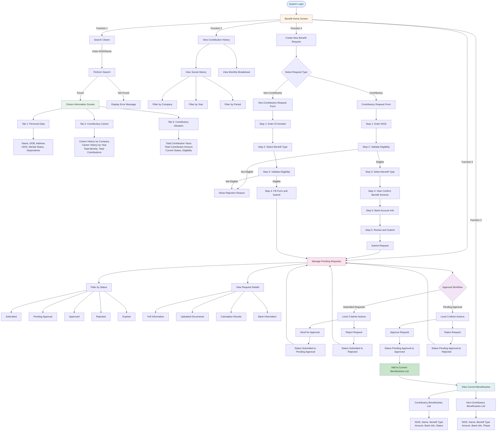
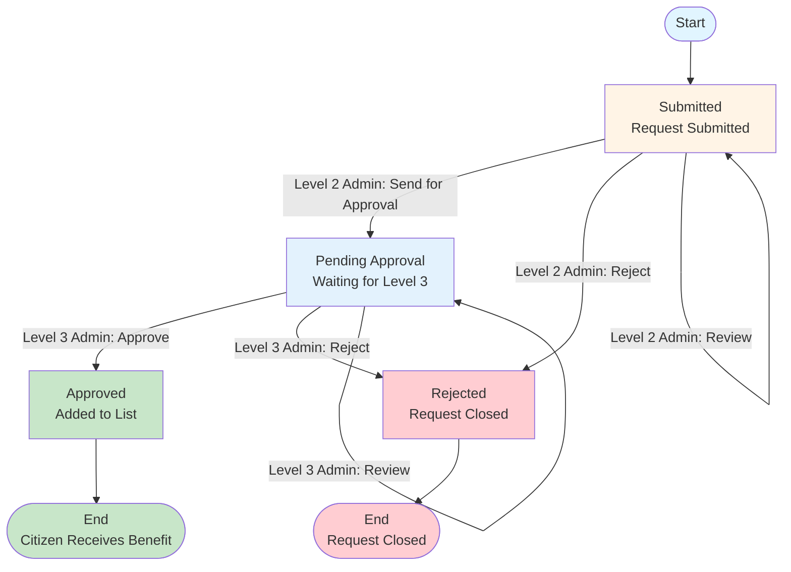
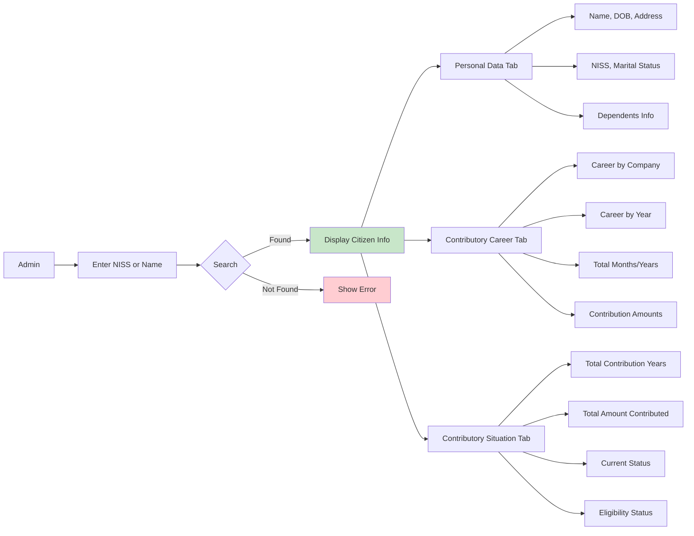
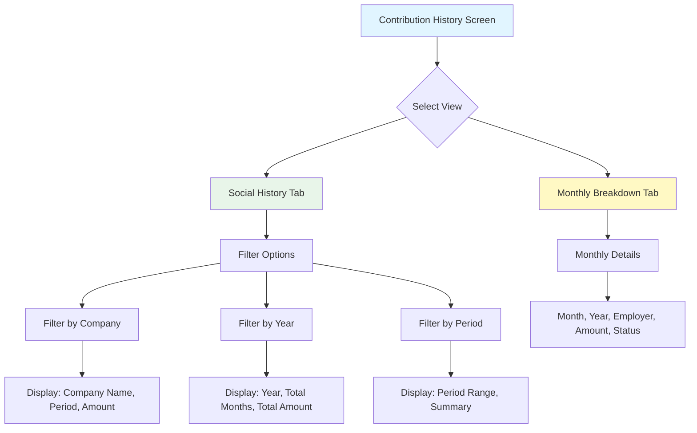
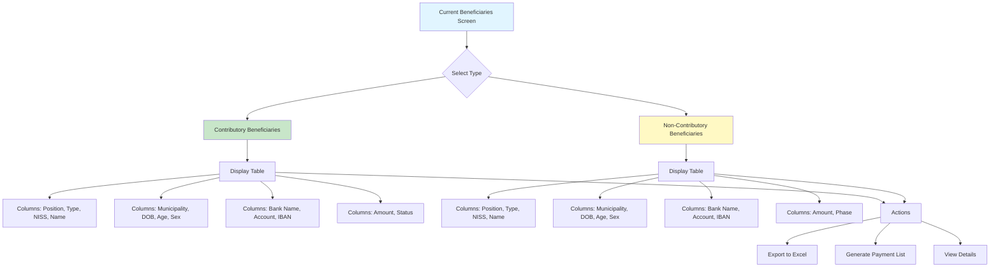
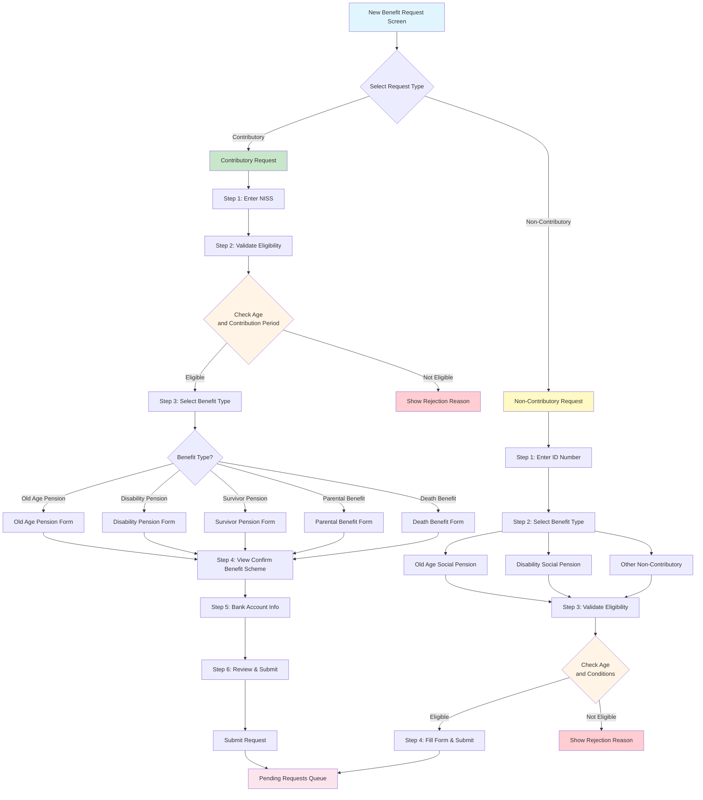

# Benefit Management System - Module Diagram

## System Overview

The Benefit Management System allows administrators to manage the entire benefit process for citizens, including:
- **Search citizen information** by NISS number or name
- **View contribution history** by company and by year
- **Manage list of current beneficiaries** (contributory and non-contributory)
- **Create new benefit requests** for citizens
- **Approve or reject** benefit requests through a 3-level approval process

---

## 1. Main Business Process Flow

---

## 2. Approval Workflow Diagram

---

## 3. Search and View Citizen Information

---

## 4. View Contribution History

---

## 5. Current Beneficiaries List

---

## 6. Create New Benefit Request Flow

---

## Detailed Function Descriptions

### 1. Search Citizen
**Purpose**: Search for citizen information in the system to view history and create benefit requests

**Process**:
- Admin enters NISS number or citizen name in search field
- System searches in database
- If found: Display citizen information with 3 tabs
- If not found: Display error message

**Information Displayed**:
- **Tab 1 - Personal Data**: Name, date of birth, address, NISS, marital status, dependents
- **Tab 2 - Contributory Career**: Career history by company, by year, total months/years of contributions, total contribution amount
- **Tab 3 - Contributory Situation**: Total contribution years, total contribution amount, current status, eligibility status

### 2. View Contribution History
**Purpose**: View detailed contribution history of citizens to assess eligibility for benefits

**Views**:
- **Social History Tab**: Overview of contribution periods
  - Can filter by company
  - Can filter by year
  - Can filter by time period
- **Monthly Breakdown Tab**: View monthly contribution details
  - Month, year
  - Company/employer name
  - Contribution amount
  - Status (paid, unpaid, missing)

**Application**: Used to check if citizen meets eligibility requirements for benefits

### 3. Current Beneficiaries List
**Purpose**: Manage list of all current benefit recipients in the system

**Two Types of Lists**:
- **Contributory Beneficiaries**: People who have contributed and are receiving benefits
  - Information: Position, benefit type, NISS, name, municipality, date of birth, age, sex
  - Bank information: Bank name, account number, IBAN
  - Amount received, status (active, suspended, stopped)
  
- **Non-Contributory Beneficiaries**: People receiving social benefits (no contribution required)
  - Similar information as above
  - Phase (Phase I, II, III) instead of status

**Actions Available**:
- Export list to Excel file
- Generate payment list for bank
- View details of each beneficiary

### 4. Create New Benefit Request
**Purpose**: Create request to add citizen to benefit recipient list

**Two Types of Requests**:

**A. Contributory Request** (6 steps):
1. **Step 1**: Enter NISS number
2. **Step 2**: System validates eligibility (age and contribution period)
   - If eligible: Continue
   - If not eligible: Show rejection reason and stop
3. **Step 3**: Select benefit type (Old Age Pension, Disability Pension, Survivor Pension, Parental Benefit, Death Benefit)
4. **Step 4**: View/Confirm Benefit Scheme (includes: personal data, professional situation, contributory career, contributory situation, calculation & documents)
5. **Step 5**: Enter bank account information for benefit payment
6. **Step 6**: Review all information and submit request

**B. Non-Contributory Request** (simpler):
- Step 1: Enter ID number
- Step 2: Select social benefit type (Old Age Social Pension, Disability Social Pension, etc.)
- Step 3: System validates eligibility (age and conditions)
- Step 4: Fill form and submit request

### 5. Approve/Reject Requests
**Purpose**: Review and decide on submitted benefit requests

**3-Level Approval Process**:

**Level 1**: No approval rights (view only)

**Level 2 - Level 2 Admin**:
- Handles requests with "Submitted" status
- Can:
  - **Send for Approval**: Forward request to Level 3 Admin
  - **Reject**: Reject request if not eligible
  - **View Details**: View full information, documents, calculations

**Level 3 - Level 3 Admin**:
- Handles requests with "Pending Approval" status
- Can:
  - **Approve**: Approve request (final decision) → Citizen added to beneficiary list
  - **Reject**: Reject request
  - **View Details**: View full information

**Request Statuses**:
- **Submitted**: New request submitted, waiting for Level 2 Admin review
- **Pending Approval**: Forwarded by Level 2 Admin, waiting for Level 3 Admin approval
- **Approved**: Approved, citizen added to beneficiary list
- **Rejected**: Rejected, request closed
- **Expired**: Request expired after 30 days without processing

**Features**:
- View request details (citizen information, documents, calculation results, bank information)
- Approve/reject individual requests or multiple requests at once
- Add comments/notes when approving or rejecting

---

## Benefit Types

### Contributory Benefits
Benefits for people who have contributed to social security:

1. **Old Age Pension (PV - Pensão de Velhice)**
   - For people who have reached retirement age and contributed sufficient years

2. **Disability Pension (PI - Pensão de Invalidez)**
   - For people with disabilities, loss of work capacity
   - Can receive one-time or monthly

3. **Survivor Pension**
   - For relatives of deceased (spouse, children, parents)
   - Distributed by percentage

4. **Parental Benefit**
   - For people who give birth or adopt children
   - Multiple types: maternity, paternity, clinical risk, etc.

5. **Death Benefit**
   - One-time benefit for family when contributor dies
   - Includes funeral allowance

### Non-Contributory Benefits
Social benefits for people without means to contribute:

1. **Old Age Social Pension (PSV - Pensão Social de Velhice)**
   - For elderly people without income or low income

2. **Disability Social Pension**
   - For disabled people without work capacity and no income

3. **Other Non-Contributory Benefits**
   - Other social benefits as per regulations

---

## Calculation Formulas

The system automatically calculates benefit amounts based on the following formulas:

### 1. Old Age Pension
**Formula**: `P = (R / N) × Total Contribution Months`

**Explanation**:
- **R (Reference Remuneration)**: Reference salary = Average of best 120 months in last 10 years
- **N**: 360 months (equivalent to 30 years - standard contributory career period)
- **Total Contribution Months**: Total months citizen has contributed

**Example**: If R = $500, contributed 308 months → P = (500/360) × 308 = $427.78/month

### 2. Survivor Pension
**Formula**: 
- Monthly pension: `P = (R / N) × Total Contribution Months`
- Funeral allowance: `Funeral Allowance = 3 × R`

**Explanation**: Similar to old age pension, but distributed among multiple relatives by percentage

### 3. Disability Pension
**Two Types**:
- **Monthly pension**: `P = (R / N) × Total Contribution Months` (similar to old age pension)
- **One-time payment**: `One-Time Amount = 24 × Monthly Amount`

### 4. Parental Benefit
**Formula**: 
- Daily benefit: `Daily Benefit = R / 180`
- Total amount: `Total = Daily Benefit × Duration Days`

**Duration varies by type**:
- Maternity: 90 days
- Paternity: 7 days
- Clinical risk: 60 days
- Adoption: 90 days

### 5. Death Benefit
**Formula**: `Amount = 3 × R`

**Explanation**: According to Article 18, DL 19/2017, death benefit equals 3 times reference remuneration (R)

---

## System Summary

The Benefit Management System (Benefit Module) is a comprehensive solution to manage the entire benefit process for citizens, from searching information, viewing contribution history, to creating new benefit requests and approving requests.

### System Strengths:

✅ **Fast Search**: Search citizens by NISS or name in seconds

✅ **Complete Information**: Display full personal information, career history, and contribution status

✅ **Detailed History**: View contribution history by company, by year, or by month

✅ **Centralized Management**: Centralized management of all benefit recipients (contributory and non-contributory)

✅ **Automation**: System automatically checks eligibility and calculates benefit amounts

✅ **Clear Process**: 3-level approval process ensures transparency and control

✅ **Diverse Support**: Supports both contributory and non-contributory benefits with various benefit types

### Benefits:

- **Time Saving**: Automates checking and calculation steps
- **Error Reduction**: System automatically calculates, minimizing human errors
- **Transparency**: Clear approval process, traceable
- **Efficiency**: Centralized management, easy to search and report
